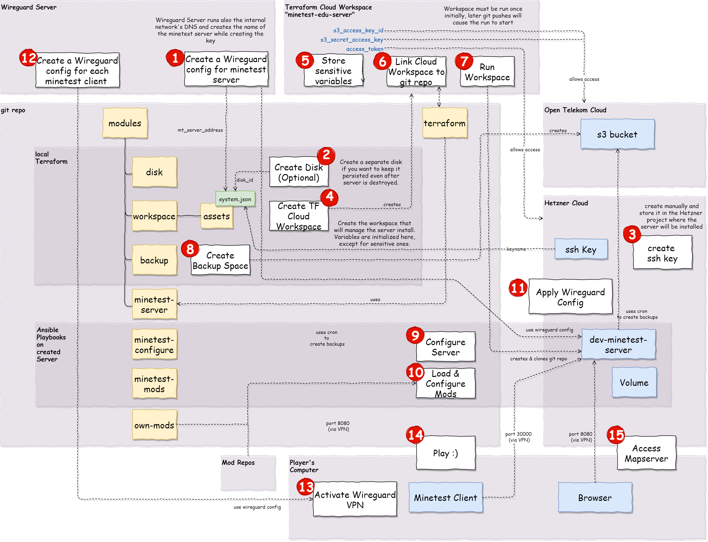

# minetest-edu-server

Provide a stable one-stop-shop routine to install a Hetzner cloud machine with an immutable minetest base installation and merge optional mod projects.

Thanks to @nautik1 for providing the original ansible playbook



## Install with Terraform Cloud

Prerequisite: you need 
* a Terraform Cloud account
* a git account that you can connect with Terraform Cloud
* a local terraform binary of at least 0.13.x.
* a local ~/.terraformrc file with an API Token set up to connect to Terraform Cloud.

* If you want to build the server's disk independently from the main project, go to modules/disk first, and follow the README there.
* Checkout this project then go to `modules/workspace`. Adopt the disk_id in the system.json file if you created the disk separately.
* Run `terraform init`
* Run `terraform apply`. The future provisioning workspace will now be created in Terraform Cloud.
* In Terraform Cloud, fill in the sensitive variables - Hetzner API Access Token and default password for future users of the server
* Connect the Terraform Workspace with the project repo. Github and gitlab work good. Make sure the terraform directory is set to `terraform` (should be already set).
* Run the Queue initially once. Terraform starts init and apply scripts and after 2 minutes you have your minetest server.
* Future changes to the gitlab project lead to an automated update. The data disk is mounted on an individual disk - if you don't change the disk definition, it will survive even a server reconstruction. The external disk is mounted at `/usr/share/disk`.
* The base configuration of the server is performed from the `start_configure.yml` ansible playbook. It is called automatically by terraform. However since Wireguard installation is not yet completely automated, you should run the playbook again after Wireguard configuration and before the mods playbook. To do si, go to `/opt/bootstrap/minetest-edu-server/modules` and start `ansible-playbook start_configure.yml`.

## Get your Wireguard service running

The project is prepared to run in a wireguard-driven environment.
You must create the proper wireguard client configuration in `/etc/wireguard/wg0.conf`: 

```conf
[Interface]
Address=<your server's IP>/32
DNS=<the DNS server's IP, sometimes on the Wireguard server>
PrivateKey=<Your private key>

[Peer]
PublicKey=<The wireguard Server's public key>
AllowedIPs=<CIDR of the private subnet>
Endpoint=<IP:Port of gthe Wireguard server>
PersistentKeepalive=25
```

You can use [selfscrum/wireguard_network](https://github.com/selfscrum/wireguard_network) to mostly automate the creation of a wireguard server. The project is still a bit rough but might help in getting things running.

## Configure Mods

Before you start the mod configuration, the server must complete its installation, which takes some minutes.
Ensure that your environment and your `~.profile` file contains the proper `MT_` environment variables when you login. 

Mods can be installed independently from another playbook on the installed server, which is located in `/opt/bootstrap/minetest-edu-server/modules/start_mods.yml`.
This playbook loads all modules and might modify the existing minetest.conf After successful deployment, the minetest service is automatically restarted.

## Mapserver

The mapserver is available from http://<server-address>:8080. Since the system is intended for internal use behind a VPN, it is not configured with SSL. It is configured with the hostname as addressed in the terraform `mt_server_address` variable.

## Backup

We use an S3 bucket to store backup data in a cheap and easy way. For GDPR reasons, we have built this connection to a Telekom storage server. It should also work fine with another S3 clone service or the original AWS.

# Features to come
* add wireguard client for secure access automatically
* integrated hugo web site for explanation of locations (links from map)
